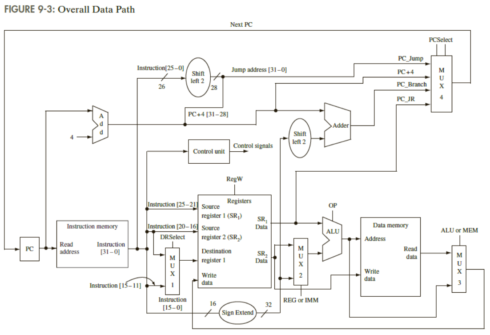

---
cssclasses:
  - width-100
---

### MIPS 디지털 회로
---
**Program Counter (PC)**
- 현재 명령어의 주소를 저장합니다.
- 다음 주소(`PC + 4`), 조건 분기 주소, 또는 점프 주소 중에서 선택된 값을 사용해 갱신

**Instruction Memory**
- `PC`가 가리키는 주소에서 명령어를 가져옴
- 명령어는 디코더(Decoder)와 제어 유닛(Control Unit)으로 전달

**Control Unit**:
- 명령어의 `opcode`를 해석하여 제어 신호를 생성
- 제어 신호는 데이터 경로의 다른 구성 요소(ALU, MUX, 레지스터 등)를 조정

**Registers (레지스터 파일)**
- 소스 레지스터(`SR1`, `SR2`)에서 데이터를 읽어오거나, 목적 레지스터에 데이터를 씀
- 명령어의 필드(`rs`, `rt`, `rd`)를 사용해 작업할 레지스터를 선택

**ALU (Arithmetic Logic Unit)**
- 산술 및 논리 연산을 수행
- 제어 신호(`OP`)에 따라 연산의 종류가 결정
- 입력 데이터는 레지스터 값 또는 상수 값(Immediate)

**Data Memory**
- 메모리 명령어(LW, SW)에서 사용
- 계산된 주소에 따라 데이터를 읽거나 씀

**MUX (Multiplexers)**
- PC 경로, 레지스터 입력, ALU 입력 등에 사용

**Sign Extend**
- 상수 값(16비트)을 32비트로 확장하여 ALU 또는 데이터 경로에 전달

### MIPS 동작 방식
---
**1) Instruction Fetch (IF)**
- 명령어 메모리에서 현재 PC(Program Counter)가 가리키는 명령어를 읽음
- **PC (Program Counter)**: 현재 실행 중인 명령어의 주소를 저장
- **Instruction Memory**: 명령어를 저장하고 가져오는 역할

**2) Instruction Decode (ID)**
- 가져온 명령어를 해석하고 필요한 제어 신호를 생성
- 레지스터 파일에서 operand 값을 읽음
- 상수 값(Immediate) 확장(Sign Extend) 필요 시 수행
- **Control Unit**: 명령어의 opcode를 읽고 제어 신호를 생성
- **Register File**: 소스 레지스터 값을 읽음
- **Sign Extender**: 16비트 상수 값을 32비트로 확장

**3) Execute (EX)**
- ALU를 사용해 산술 연산이나 주소 계산을 수행
    - 예: 덧셈, 뺄셈, AND, OR 연산, 메모리 주소 계산
- **ALU**: 연산 수행
- **ALU Control**: ALU 연산을 결정하는 제어 신호 생성
- **MUX**: ALU 입력을 결정 (레지스터 값 또는 확장된 상수 값)

**4) Memory Access (MEM)**
- 데이터 메모리에 읽기/쓰기 연산을 수행하거나 분기(Branch) 주소를 결정
- **Data Memory**: 데이터 읽기/쓰기
- **Branch Logic**: 분기 여부 판단 및 PC 업데이트

**5) Write Back (WB)**
- 실행 결과를 레지스터 파일에 기록
    - 예: 연산 결과나 메모리에서 읽은 데이터를 목적 레지스터에 저장
- **MUX**: 연산 결과(ALU) 또는 메모리 값 중 기록할 데이터를 선택
- **Register File**: 데이터를 목적 레지스터에 기록

### README.md 자료
---
#### 동작 방식

| 단계  |                                             전송                                             |                  신호                   |
| :-: | :----------------------------------------------------------------------------------------: | :-----------------------------------: |
| IF  |                                  PC -> Instruction Memory                                  |               명령어 주소 전달               |
| ID  | Instruction Memory -> Instruction Decoder Instructino Decoder -> Control Unit, Register | 명령어 해석 후 각각 전달 연산 종류와 소스 레지스터 값 전달 |
| EX  |                               Control Unit, Register -> ALU                                |          연산 종류와 소스 레지스터 값 전달          |
| MEM |                                       ALU -> Memory                                        |           (필요에 따라) 연산 결과 전달           |
| WB  |                                      ALU -> Register                                       |               연산 결과 전달                |

#### 명령어 (RISC-V)
##### 기본 명령어 형식

|   종류   |                                     비트                                      | 역할                |
| :----: | :-------------------------------------------------------------------------: | :---------------- |
| R-type |                func7 \| rs2 \| rs1 \| func3 \| rd \| opcode                 | 레지스터 간 연산         |
| I-type |                  imm[11:0] \| rs1 \| func3 \| rd \| opcode                  | 상수 값 연산, Load 명령어 |
| S-type |           imm[11:5] \| rs2 \| rs1 \| func3 \| imm[4:0] \| opcode            | 메모리 저장            |
| B-type | imm[11] \| imm[9:4] \| rs2 \| rs1 \| func3 \| imm[3:0] \| imm[10] \| opcode | 조건 분기             |
| U-type |                          imm[19:0] \| rd \| opcode                          | 상위 20비트 상수 값 처리   |
| J-type |        imm[19] \| imm[9:0] \| imm[10] \| imm[18:11] \| rd \| opcode         | 점프 및 링크           |

##### 명령어 종류
- opcode -> [6:5] : 명령어 형식, [4:2] : 세부 동작, [1:0] : 고정(11)
- R-type : 10개

| 명령어  |        사용법        |         동작          | opcode  | fun3 |  func7  |          |
| :--: | :---------------: | :-----------------: | :-----: | :--: | :-----: | :------: |
| ADD  | add rd, rs1, rs2  |   rd = rs1 + rs2    | 0110011 | 000  | 0000000 |          |
| SUB  | sub rd, rs1, rs2  |   rd = rs1 - rs2    | 0110011 | 000  | 0100000 |          |
| SLL  | sll rd, rs1, rs2  |   rd = rs1 << rs2   | 0110011 | 001  | 0000000 |          |
| SLT  | slt rd, rs1, rs2  | rd = rs1 $\leq$ rs2 | 0110011 | 010  | 0000000 |          |
| SLTU | sltu rd, rs1, rs2 |   rd = rs1 < rs2    | 0110011 | 011  | 0000000 |          |
| XOR  | xor rd, rs1, rs2  |   rd = rs1 ^ rs2    | 0110011 | 100  | 0000000 |          |
| SRL  | srl rd, rs1, rs2  |   rd = rs1 >> rs2   | 0110011 | 101  | 0000000 | 논리 shift |
| SRA  | sra rd, rs1, rs2  |  rd = rs1 >>> rs2   | 0110011 | 101  | 0100000 | 산술 shift |
|  OR  |  or rd, rs1, rs2  |   rd = rs1 & rs2    | 0110011 | 110  | 0000000 |          |
| AND  | and rd, rs1, rs2  |   rd = rs1 \| rs2   | 0110011 | 111  | 0000000 |          |

- I-type : 15개

|  명령어  |         사용법          |           동작            | opcode  | func3 |                imm                |                                      |
| :---: | :------------------: | :---------------------: | :-----: | :---: | :-------------------------------: | :----------------------------------: |
| ADDI  |  addi rd, rs1, imm   |      rd = r1 + imm      | 0010011 |  000  |                                   |         NOP : ADDI x0, x0, 0         |
| SLLI  | slli rd, rs1, shamt  |     rd = rs1 << imm     | 0010011 |  001  | [11:5] : 0000000 [4:0] : shamt |                                      |
| SLTI  |  slti rd, rs1, imm   |     rd = rs1 < imm      | 0010011 |  010  |                                   |                                      |
| SLTIU |  sltiu rd, rs1, imm  |   rd = r1 $\leq$ imm    | 0010011 |  011  |                                   |                                      |
| XORI  |  xori rd, rs1, imm   |      rd = r1 & imm      | 0010011 |  100  |                                   |                                      |
| SRLI  | srli rd, rs1, shamt  |     rd = rs2 >> imm     | 0010011 |  101  | [11:5] : 0000000 [4:0] : shamt |               논리 shift               |
| SRAI  | srai rd, rs1, shamt  |    rd = rs2 >>> imm     | 0010011 |  101  | [11:5] : 0100000 [4:0] : shamt |               산술 shift               |
|  ORI  |   ori rd, rs1, imm   |     rd = r1 \| imm      | 0010011 |  110  |                                   |                                      |
| ANDI  |  andi rd, rs1, imm   |      rd = r1 & imm      | 0010011 |  111  |                                   |                                      |
|  LB   |  lb rd, offset(rs1)  |  rd = Memory[rs1+imm]   | 0000011 |  000  |              offset               |                바이트 로드                |
|  LH   |  lh rd, offset(rs1)  |  rd = Memory[rs1+imm]   | 0000011 |  001  |              offset               |               하프워드 로드                |
|  LW   |  lw rd, offset(rs1)  |  rd = Memory[rs1+imm]   | 0000011 |  010  |              offset               |                워드 로드                 |
|  LBU  | lbu rd, offset(rs1)  |  rd = Memory[rs1+imm]   | 0000011 |  100  |              offset               |           unsigned 바이트 로드            |
|  LHU  | lhu rd, offset(rs1)  |  rd = Memory[rs1+imm]   | 0000011 |  101  |              offset               |           unsigned 하프워드 로드           |
| JALR  | jalr rd, offset(rs1) | rd = PC+4, PC = rs1+imm | 1100111 |  000  |              offset               | 다음 PC 주소를 저장하고, 서브 루틴(rs1+imm) 시작 |

- S-type : 3개

| 명령어 |         사용법         |          동작           | opcode  | func3 |  imm   |         |
| :-: | :-----------------: | :-------------------: | :-----: | :---: | :----: | :-----: |
| SB  | sb rs2, offset(rs1) | Memory[rs1+imm] = rs2 | 0100011 |  000  | offset | 바이트 저장  |
| SH  | sh rs2, offset(rs1) | Memory[rs1+imm] = rs2 | 0100011 |  001  | offset | 하프워드 저장 |
| SW  | sw rs2, offset(rs1) | Memory[rs1+imm] = rs2 | 0100011 |  010  | offset |  워드 저장  |

- B-type : 6개

| 명령어  |          사용법          |             동작              | opcode  | func3 |  imm   |               |
| :--: | :-------------------: | :-------------------------: | :-----: | :---: | :----: | :-----------: |
| BEQ  | beq rs1, rs2, offset  |   if (rs1==rs2) PC += imm   | 1100011 |  000  | offset |               |
| BNE  | bne rs1, rs2, offset  |   if (rs1!=rs2) PC += imm   | 1100011 |  001  | offset |               |
| BLT  | blt rs1, rs2, offset  |   if (rs1<rs2) PC += imm    | 1100011 |  100  | offset |               |
| BGE  | bge rs1, rs2, offset  | if (rs1$\geq$rs2) PC += imm | 1100011 |  101  | offset |               |
| BLTU | bltu rs1, rs2, offset |   if (rs1<rs2) PC += imm    | 1100011 |  110  | offset | unsigned 값 비교 |
| BGEU | bgeu rs1, rs2, offset | if (rs1$\geq$rs2) PC += imm | 1100011 |  111  | offset | unsigned 값 비교 |

- U-type : 2개

|  명령어  |       사용법       |          동작           | opcode  |                      |
| :---: | :-------------: | :-------------------: | :-----: | :------------------: |
|  LUI  |  lui rd, imm20  |    rd = imm << 12     | 0110111 | 32비트 명령어에서 imm 값만 추출 |
| AUIPC | auipc rd, imm20 | rd = PC + (imm << 12) | 0010111 |                      |

- J-type : 1개

| 명령어 |      사용법       |          동작          | opcode  |         |
| :-: | :------------: | :------------------: | :-----: | :-----: |
| JAL | jal rd, offset | rd = PC+4, PC += imm | 1101111 | 단순 Jump |
